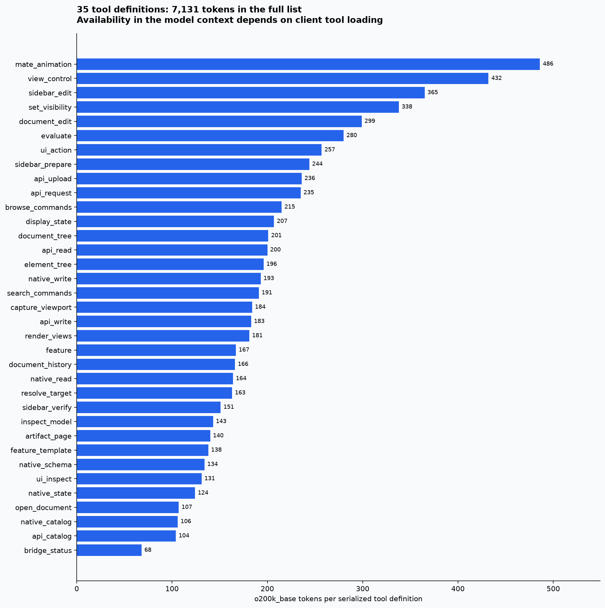
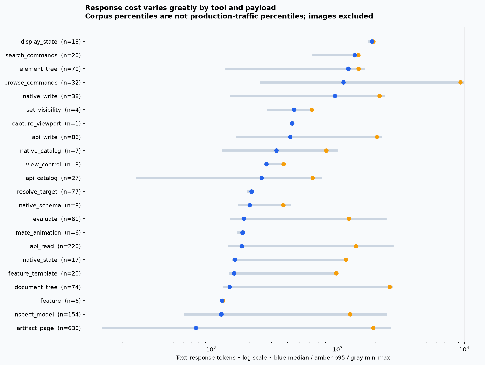
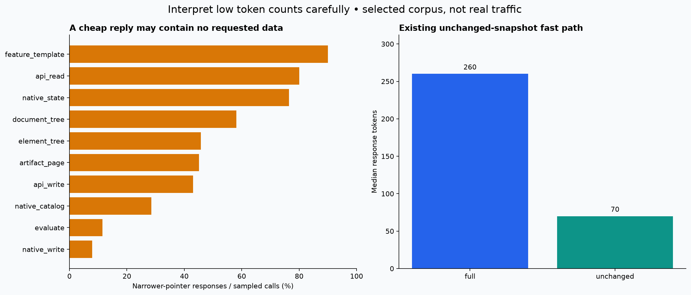
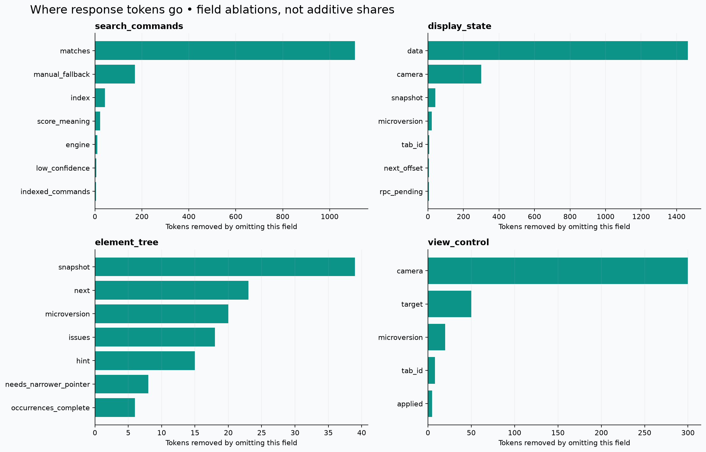
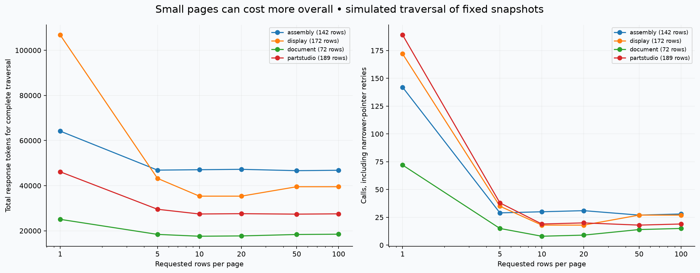
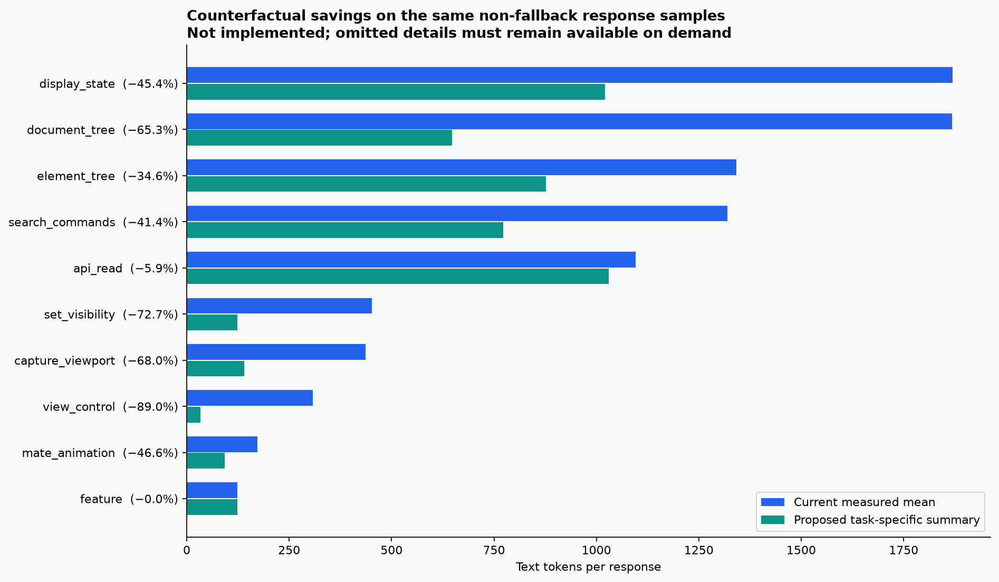
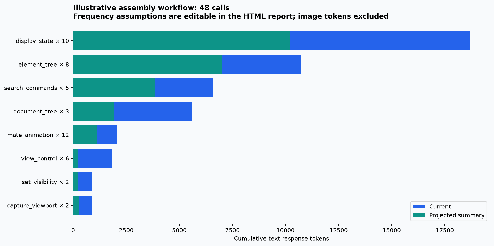

# Onshape Native context audit

Measured 2026-10-07 against v0.4.0. **1,579 text samples**, **22/35 tools with response samples**, all **35 tool definitions and output paths audited**. No CAD requests or mutations were made. Raw document content, IDs, screenshots and pairing credentials are not included in this report.

**Observed frequency is now available:** [two-thread frequency audit](usage/README.md) · [interactive frequency dashboard](usage/index.html). This supplements the artifact-size corpus with actual call counts; it does not treat cache files as invocation logs.


## Findings

The tool does **not** enforce a fixed number of tokens per call. Most generic returns check a 7,000-character data payload, inspection checks 9,000 characters, and some tools bound only row counts. Metadata, camera arrays, instructions and client framing are outside these checks. A response that is small in bytes can still be expensive in tokens because of IDs, matrices and JSON structure.

The complete tool-definition list is **7,131 o200k_base tokens**. Server instructions add **146**, and the modeling skill is **2,001** when loaded. These are separate context surfaces: clients may defer tools, cache prompts, wrap schemas differently or compact history. Do not add the entire definition list to every call, and do not confuse cache discounts with fewer context tokens.

A ten-result command search repeats a **167-token manual procedure**, plus engine/index/score explanations and verbose invocation records. Display pages repeat a full camera even when only visibility is requested. Structure rows repeat URLs, ancestry, raw pointers and—in assemblies—transforms. Camera commands return full matrices even for a simple successful fit. These are the strongest targeted opportunities.

## Measurement method and limits

- Exact text tokenization uses [`tiktoken`](https://github.com/openai/tiktoken), `o200k_base`; `cl100k_base` is a sensitivity check. These are **not verified Codex or Claude billing counts** and do not imply those clients use these encodings. Versions are recorded in `metrics.json`.
- `samples.csv` measures returned compact JSON text before client-specific wrapping. It separately records a serialized MCP text-block token count, UTF-8 bytes and request tokens where arguments are known. Request-token gaps mean unknown, not zero. Full JSON-RPC wire envelopes are not assumed to enter model context.
- Discovery functions were executed locally. Historical artifacts were passed through production response formatters. Part Studio inspections and visibility acknowledgements were reconstructed from saved data; recorded motion/camera returns are labeled separately. No synthetic response is labeled as live. Existing artifact contents are not modified by the audit.
- Percentiles describe this **selected corpus**, not actual usage frequency. Content-addressed storage deduplicates identical responses and overrepresents past research workflows. Frequency recommendations are hypotheses until client telemetry exists.
- No token count is assigned to images. An inline image is not ordinary base64 text in model context. `capture_viewport` counts only its metadata; `render_views` has no sampled return. Image dimensions/detail/client processing need separate measurement.
- Large raw artifacts are **not** equated with model-visible output. The actual paging/refusal result is measured. There were **615 pointer-fallback responses** in this corpus; these contain little useful payload but can trigger extra calls.
- Response measurements remain missing for: `document_history`, `document_edit`, `sidebar_edit`, `sidebar_prepare`, `sidebar_verify`, `render_views`, `bridge_status`, `native_read`, `api_upload`, `open_document`, `ui_inspect`, `ui_action`, `api_request`. Their definitions and code paths were still reviewed. They are unknown, not free. There is no mutation replay to manufacture coverage. 1 assembly caches predating completeness fields were excluded from this run; skipped/reconstruction errors are recorded in `metrics.json`.

## Tool-definition overhead



`inputSchema`, descriptions, enum choices, defaults and annotations all contribute. Keep constraints necessary for safe use. Potential savings come from removing autogenerated schema titles/default boilerplate, using consistent concise descriptions, and testing client-supported deferred discovery. Returning ten candidates does not itself unload the 35 registered tool schemas.

## Per-tool response sizes



The range includes different operations and success/fallback variants. In particular, `inspect_model` combines full and unchanged snapshots, while `api_catalog` combines search and schema results. Use `variant` in the CSV to compare like with like. `browse_commands` includes explicit limits of 1, 10 and 100; its maximum is not the default-call cost.



`inspect_model` has a median of **260 tokens for full reads** versus **70 for unchanged reads** in this corpus. Most raw assembly-definition reads and many feature-template root reads returned a narrower-pointer hint rather than data. These are measured results for naive default/root requests, not observed agent failure rates. Exact pointers and projections matter as much as shorter text. See `variants.csv` for separate distributions.

| Tool | Definition tokens | Samples | Median response | p95 | Maximum |
|---|---:|---:|---:|---:|---:|
| `api_catalog` | 104 | 27 | 251 | 636 | 740 |
| `api_read` | 200 | 220 | 175 | 1,395 | 2,705 |
| `api_request` | 235 | 0 | — | — | — |
| `api_upload` | 236 | 0 | — | — | — |
| `api_write` | 183 | 86 | 422 | 2,048 | 2,193 |
| `artifact_page` | 140 | 630 | 76 | 1,903 | 2,586 |
| `bridge_status` | 68 | 0 | — | — | — |
| `browse_commands` | 215 | 32 | 1,111 | 9,343 | 9,793 |
| `capture_viewport` | 184 | 1 | 437 | 437 | 437 |
| `display_state` | 207 | 18 | 1,865 | 1,917 | 1,924 |
| `document_edit` | 299 | 0 | — | — | — |
| `document_history` | 166 | 0 | — | — | — |
| `document_tree` | 201 | 74 | 140 | 2,574 | 2,681 |
| `element_tree` | 196 | 70 | 1,210 | 1,462 | 1,603 |
| `evaluate` | 280 | 61 | 181 | 1,224 | 2,385 |
| `feature` | 167 | 6 | 122 | 124 | 125 |
| `feature_template` | 138 | 20 | 152 | 976 | 984 |
| `inspect_model` | 143 | 154 | 120 | 1,252 | 2,393 |
| `mate_animation` | 486 | 6 | 177 | 178 | 178 |
| `native_catalog` | 106 | 7 | 327 | 811 | 975 |
| `native_read` | 164 | 0 | — | — | — |
| `native_schema` | 134 | 8 | 202 | 372 | 421 |
| `native_state` | 124 | 17 | 154 | 1,162 | 1,164 |
| `native_write` | 193 | 38 | 952 | 2,144 | 2,316 |
| `open_document` | 107 | 0 | — | — | — |
| `render_views` | 181 | 0 | — | — | — |
| `resolve_target` | 163 | 77 | 208 | 209 | 210 |
| `search_commands` | 191 | 20 | 1,362 | 1,456 | 1,466 |
| `set_visibility` | 338 | 4 | 452 | 622 | 624 |
| `sidebar_edit` | 365 | 0 | — | — | — |
| `sidebar_prepare` | 244 | 0 | — | — | — |
| `sidebar_verify` | 151 | 0 | — | — | — |
| `ui_action` | 257 | 0 | — | — | — |
| `ui_inspect` | 131 | 0 | — | — | — |
| `view_control` | 432 | 3 | 273 | 373 | 384 |

## Repeated fields and pagination



Each bar removes one top-level field from a representative median response and retokenizes. Ablations are **not additive** because token boundaries change. Removing an entire `data` or `matches` field is diagnostic, not a recommendation to hide the information the agent needs.



These traversals use one largest saved snapshot per kind, never fresh reads between pages. The simulated caller halves its requested limit after a narrower-pointer result and follows `next_offset`. `display_state` performs its own halving. Tiny pages often increase total cost by repeating snapshot IDs and metadata. A better design budgets tokens dynamically and fills each page efficiently, while preserving continuation pointers and completeness.

## Measured counterfactuals—not implemented optimizations



| Tool | Current mean | Proposed mean | Reduction |
|---|---:|---:|---:|
| `document_tree` | 1,868 | 648 | 65.3% |
| `display_state` | 1,869 | 1,021 | 45.4% |
| `search_commands` | 1,320 | 773 | 41.4% |
| `element_tree` | 1,341 | 877 | 34.6% |
| `set_visibility` | 452 | 124 | 72.7% |
| `capture_viewport` | 437 | 140 | 68.0% |
| `view_control` | 308 | 34 | 89.0% |
| `mate_animation` | 173 | 92 | 46.6% |
| `api_read` | 1,095 | 1,030 | 5.9% |
| `feature` | 123 | 123 | 0.0% |

The proposed summaries are task-specific views, not interchangeable lossless replacements. Search retains command names, evidence and routing, but moves manual instructions to the skill. Display drops the camera and duplicate row details. Tree browsing keeps hierarchy/IDs/status and makes transforms/URLs/raw pointers opt-in. Camera acknowledgements omit matrices unless requested. Motion drops repeated target/angle-source prose and duplicate angle units. Successful visibility batches keep aggregate verification and the checks artifact; failures must retain diagnostics. Generic replies omit local filesystem paths where an artifact handle suffices. Exact proposed projections are in `lean()` in the audit script.

**Never remove:** target disambiguation, freshness/revision guards, verification failures, partial completion, suppressed/hidden ancestor state, continuation pointers, or stable references needed for the next operation. A one-token “OK” cannot carry all of these. A concise success acknowledgement can, however, avoid hundreds of unrelated tokens.

## Workflow cost and optimization order



The explicit **48-call** scenario above produces **47,324 current vs 24,871 proposed text tokens**, using measured mean costs and assumed call counts. It excludes request arguments, schemas, skill loading, image tokens, model reasoning and client framing. It is a what-if estimate, not a traced task or a guaranteed reduction. The HTML calculator lets you change each frequency.

1. **Add response-only telemetry first.** Record tool, action, tokenizer/version, token/byte counts, latency, outcome and request variant; do not log raw model text, tokens/credentials or full URLs. Separate success, error, fallback and image metadata. Use real frequency × avoidable tokens to rank work.
2. **Make camera state opt-in and provide terse acknowledgements.** `display_state(include_camera=false)` and `view_control(detail="ack")` would remove the most obvious repeated numeric output. Preserve explicit camera readback for validation/save/restore.
3. **Slim discovery.** Keep ten useful results; return the fallback procedure only on request or low confidence. Avoid repeating schemas already exposed by MCP. Measure whether fewer candidates increases follow-up calls before changing the default.
4. **Add field projections and changed-since reads.** Browsing seldom needs 16-number transforms for every occurrence. Query visibility changes or requested references directly; retain full artifacts for details. Existing `inspect_model(previous=...)` already supplies a cheap unchanged result and should be used consistently.
5. **Implement a token-aware page budget.** For example, a configurable 600–1,200-token target for normal summaries, with an explicit override for schemas/topology. Charge envelope overhead first, pack rows to budget, and return exact continuation. Never truncate IDs, JSON or diagnostics. One oversized row should return a pointer and enough identity to fetch it.
6. **Reduce schema/skill overhead only after response hot spots.** Test a compact schema export and deferred tool loading in each client. Avoid consolidating tools so aggressively that agents repeatedly fetch giant schemas or choose the wrong operation.

Acceptance tests should compare task completion, total calls, total response tokens, failure-diagnostic preservation and reference correctness on the same frozen fixtures. Target a reduction in **whole-task** tokens, not merely a smaller first response. Add separate limits for errors and notices, whose source text can bypass a nominal success budget.

## Complete output-path inventory

- **api_catalog** ([source](../../onshape_native/server.py#L127)): Search: 10 summaries, 180 characters each. Schema: Store.response, 7,000-character data check.
- **api_read** ([source](../../onshape_native/server.py#L134)): Store.response; default 20 entries, 7,000-character data check, metadata outside cap.
- **api_request** ([source](../../onshape_native/server.py#L389)): Store.response for JSON; binary output is a file artifact.
- **api_upload** ([source](../../onshape_native/server.py#L338)): Store.response; upload byte limit is not a response token limit.
- **api_write** ([source](../../onshape_native/server.py#L199)): Store.response; raw response paged after write.
- **artifact_page** ([source](../../onshape_native/server.py#L145)): Store.page; default 20 entries, 7,000-character data check; zero remote calls.
- **bridge_status** ([source](../../onshape_native/server.py#L283)): Direct health + all Onshape tab metadata; no global token cap.
- **browse_commands** ([source](../../onshape_native/server.py#L76)): 1–100 matches (default 10); repeated manual procedure; no character cap.
- **capture_viewport** ([source](../../onshape_native/server.py#L457)): Full camera/target/file metadata plus inline image; image cost excluded from text tokenizer.
- **display_state** ([source](../../onshape_native/server.py#L404)): Halves page size until data fits 7,000 characters; repeats full camera and metadata on every page.
- **document_edit** ([source](../../onshape_native/server.py#L101)): Direct verified result + refreshed hierarchy; no universal total token cap.
- **document_history** ([source](../../onshape_native/server.py#L95)): Default 20 scanned events; character paging and history metadata; not a token cap.
- **document_tree** ([source](../../onshape_native/server.py#L83)): Store.page: 7,000-character data check, default 20 rows; metadata outside cap.
- **element_tree** ([source](../../onshape_native/server.py#L89)): Store.page: 7,000-character data check, default 20 rows; metadata outside cap.
- **evaluate** ([source](../../onshape_native/server.py#L158)): Store.response; nested evaluation results may require a narrower pointer.
- **feature** ([source](../../onshape_native/server.py#L193)): 1–20 edits; one acknowledgement/artifact per completed feature; no total token cap.
- **feature_template** ([source](../../onshape_native/server.py#L186)): Store.response; nested parameter specifications may require a narrower pointer.
- **inspect_model** ([source](../../onshape_native/server.py#L152)): 9,000-character precheck, then replaces large collections with retrieval hints; not token based.
- **mate_animation** ([source](../../onshape_native/server.py#L425)): Direct session/status with target, angle explanation and verification on every call.
- **native_catalog** ([source](../../onshape_native/server.py#L292)): Store.response; large nested defaults/examples may trigger pointer fallback.
- **native_read** ([source](../../onshape_native/server.py#L319)): Store.response; bounded data, artifact metadata outside cap.
- **native_schema** ([source](../../onshape_native/server.py#L312)): Store.response; nested defaults may trigger pointer fallback.
- **native_state** ([source](../../onshape_native/server.py#L305)): Store.response; nested model tree may trigger pointer fallback.
- **native_write** ([source](../../onshape_native/server.py#L328)): Store.response; bounded data, artifact metadata outside cap.
- **open_document** ([source](../../onshape_native/server.py#L367)): Direct tab/open acknowledgement; no global token cap.
- **render_views** ([source](../../onshape_native/server.py#L236)): 1–4 images in one contact sheet + metadata; image token cost is client/model dependent.
- **resolve_target** ([source](../../onshape_native/server.py#L57)): Direct JSON; tab candidate count is not globally token-capped.
- **search_commands** ([source](../../onshape_native/server.py#L70)): 1–10 matches; repeated manual fallback + per-match invocation metadata; no character cap.
- **set_visibility** ([source](../../onshape_native/server.py#L414)): 1–100 changes; first 5 readback checks via Store.response + snapshot and guidance.
- **sidebar_edit** ([source](../../onshape_native/server.py#L114)): Direct verified result + refreshed hierarchy; no universal total token cap.
- **sidebar_prepare** ([source](../../onshape_native/server.py#L206)): Direct plan instructions and geometry baseline; no global output cap.
- **sidebar_verify** ([source](../../onshape_native/server.py#L219)): Store.response; observation may be up to 4,000 characters.
- **ui_action** ([source](../../onshape_native/server.py#L380)): Direct action acknowledgement/error; no global token cap.
- **ui_inspect** ([source](../../onshape_native/server.py#L373)): Store.response; control metadata paged.
- **view_control** ([source](../../onshape_native/server.py#L440)): Direct full camera arrays and target on every action/read.

## Reproduce

From `onshape-native`, run:

```sh
uv run --project . --with-requirements scripts/audit-requirements.txt \
  python scripts/token_audit.py --validation-dir /tmp
```

The validation directory is optional; without its existing motion/camera validation JSON, those sample categories are omitted. Use `--artifacts PATH` for a different local cache and `--output PATH` for a separate report. Dependencies are audit-only; the MCP runtime and response formats are unchanged. The report stores counts, tool names and source hashes only. Repeated runs may differ if the underlying artifact corpus changes.

Files: `metrics.json`, `samples.csv`, `tool-coverage.csv`, `variants.csv`, `pagination.csv`, `field-ablations.csv`, `projections.csv`, seven PNG/SVG charts, and `index.html`. The HTML works offline and includes sortable per-tool measurements and an editable workload calculator.
