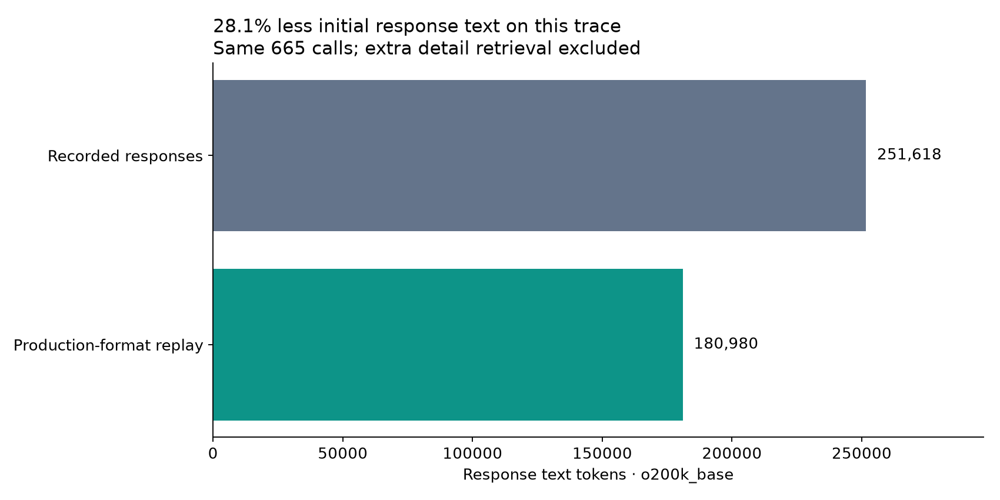
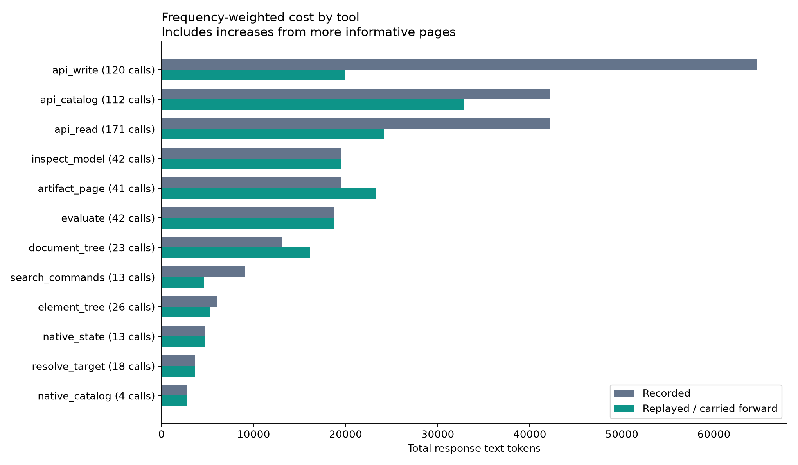
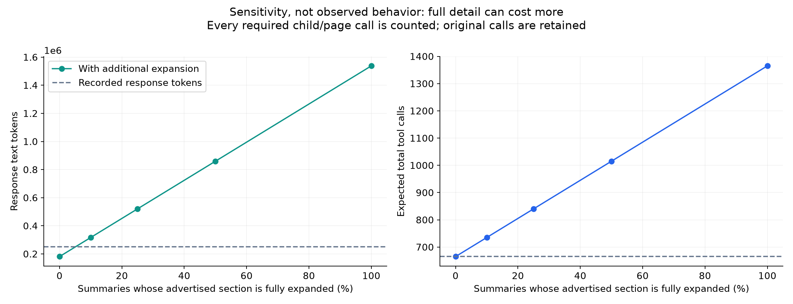

# Implemented compression: updated statistics

**Initial response text: 251,618 → 180,980 tokens (28.07% reduction).**

Previous implementation: 212,550 tokens → 180,980, an additional 31,570 tokens saved (14.85%). The archived first-pass report is in ../compression-v1/.

**Tool calls: 665 → 665 (0% reduction).** This change compresses returns; it does not eliminate calls. Additional expansion may increase call count. All 35 MCP tools remain available.



## What was measured

Replayed recoverable original responses from the two supplied threads through the **actual implemented formatting functions**, with the same original arguments and call frequencies. No CAD requests or edits were made. 473 of 665 calls could be replayed in scope; the remaining responses were carried forward unchanged, not assigned invented savings. Any missing raw payloads would be carried forward unchanged. This is an offline response-format replay, not a new end-to-end agent run or proof that task outcomes remain identical.

Tokenizer: `o200k_base`. Text only; excludes image tokens, system/tool-definition overhead, provider billing and hidden metadata. Original compact argument tokens: 101,723; they are unchanged in the main comparison. Missing exported Native responses: 0.

- unchanged tool: 167 calls
- verified cache: 460 calls
- error or non-JSON response: 25 calls
- exported discovery: 13 calls

Cached inputs are SHA-256 checked against their handles. Where a cache file is missing, a complete exported value is used only if its hash matches. Discovery responses can be reformatted directly. Unsupported/unchanged tools and explicit errors retain their historical text. Updated paging is included for replayable `artifact_page` calls. New camera/display commands with no recorded calls receive no assumed savings. Smaller default read pages defer more data; this replay does not estimate the extra calls required to consume those new continuations. The sensitivity table covers explicitly advertised deferred sections only, not all newly deferred read pages. Current hierarchy query filters are not retroactively added to old agent requests.

## Frequency-weighted results

Positive savings means fewer tokens; negative means more. More informative assembly fallbacks and larger usable page prefixes can **increase** initial output; these increases are included.

| Tool | Calls | Replayed | Before | After | Tokens saved | Reduction |
|---|---:|---:|---:|---:|---:|---:|
| `api_write` | 120 | 117 | 64,700 | 19,949 | +44,751 | +69.2% |
| `api_read` | 171 | 165 | 42,157 | 24,173 | +17,984 | +42.7% |
| `api_catalog` | 112 | 91 | 42,245 | 32,833 | +9,412 | +22.3% |
| `search_commands` | 13 | 13 | 9,059 | 4,618 | +4,441 | +49.0% |
| `element_tree` | 26 | 25 | 6,090 | 5,236 | +854 | +14.0% |
| `resolve_target` | 18 | 0 | 3,649 | 3,649 | +0 | +0.0% |
| `inspect_model` | 42 | 0 | 19,509 | 19,509 | +0 | +0.0% |
| `evaluate` | 42 | 0 | 18,692 | 18,692 | +0 | +0.0% |
| `render_views` | 4 | 0 | 320 | 320 | +0 | +0.0% |
| `feature_template` | 14 | 0 | 1,864 | 1,864 | +0 | +0.0% |
| `bridge_status` | 2 | 0 | 553 | 553 | +0 | +0.0% |
| `feature` | 12 | 0 | 1,552 | 1,552 | +0 | +0.0% |
| `sidebar_edit` | 1 | 0 | 239 | 239 | +0 | +0.0% |
| `document_edit` | 1 | 0 | 163 | 163 | +0 | +0.0% |
| `native_state` | 13 | 0 | 4,771 | 4,771 | +0 | +0.0% |
| `native_catalog` | 4 | 0 | 2,718 | 2,718 | +0 | +0.0% |
| `native_schema` | 2 | 0 | 432 | 432 | +0 | +0.0% |
| `open_document` | 4 | 0 | 355 | 355 | +0 | +0.0% |
| `document_tree` | 23 | 23 | 13,078 | 16,114 | -3,036 | -23.2% |
| `artifact_page` | 41 | 39 | 19,472 | 23,240 | -3,768 | -19.4% |



## What if the agent needs the omitted details?

There are 158 replayed replies with an advertised deferred section. The following scenarios assume the same fraction of these replies needs its **entire advertised section**, using only `artifact_page`. Every continuation and narrower child call is counted. Feature replies expand `/feature`; schemas expand their full operation report (including deferred prose and `/responses`); discovery expands its full report; hierarchy expands `/rows`. This can overfetch compared with an agent choosing one field/row. Existing detail calls remain in the original trace, so additional expansion can also double count demand already satisfied there. These are sensitivity scenarios, not measured user behavior. Fractional call totals are statistical expectations.

| Additional full-section demand | Expected calls | Response tokens | Responses + arguments |
|---|---:|---:|---:|
| 0% | 665.0 | 180,980 | 282,703 |
| 10% | 735.0 | 316,655 | 422,173 |
| 25% | 840.0 | 520,167 | 631,377 |
| 50% | 1,015.0 | 859,354 | 980,052 |
| 100% | 1,365.0 | 1,537,728 | 1,677,400 |



Use the initial-response reduction as the verified formatting result on this sample, not a guaranteed total-workflow saving. A future live trace should record how often summaries trigger `artifact_page`, whether tasks finish, and total tokens including retrieval. The older audit's aggressive projection is not the implemented result.

## Reproduce

```sh
uv run --project . --with-requirements scripts/audit-requirements.txt \
  python scripts/compression_audit.py --thread /path/to/design.txt --thread /path/to/cameras.txt
```

Outputs: [per-call CSV](calls.csv), [per-tool CSV](tools.csv), [scenario CSV](scenarios.csv), [full metrics](metrics.json). No raw CAD payloads, document identifiers, or transcript text are included in these reports. The prior [frequency audit](../usage/README.md) is preserved.
