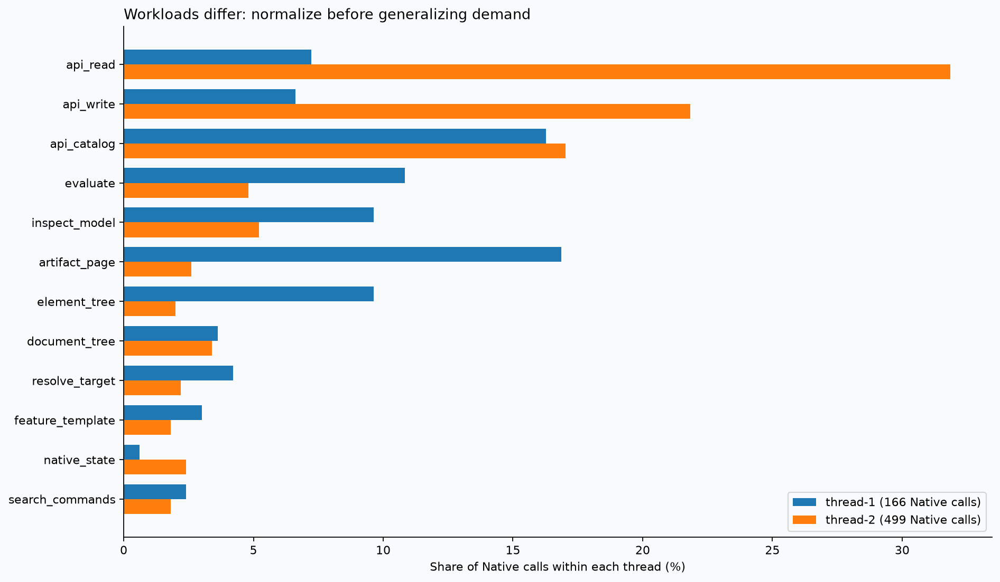
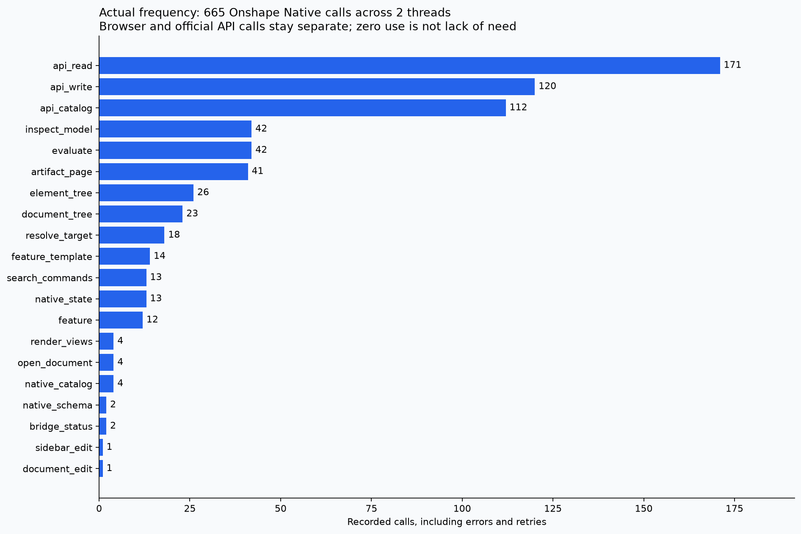
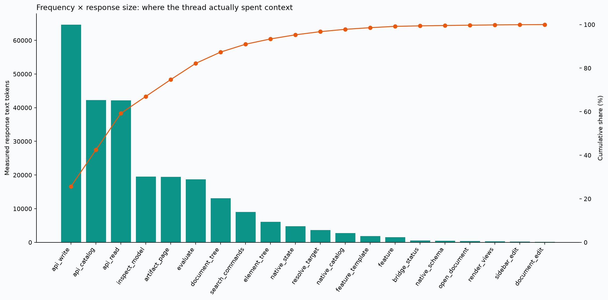
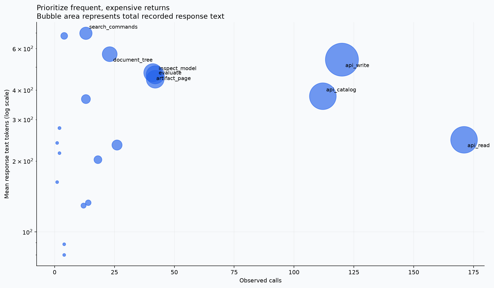
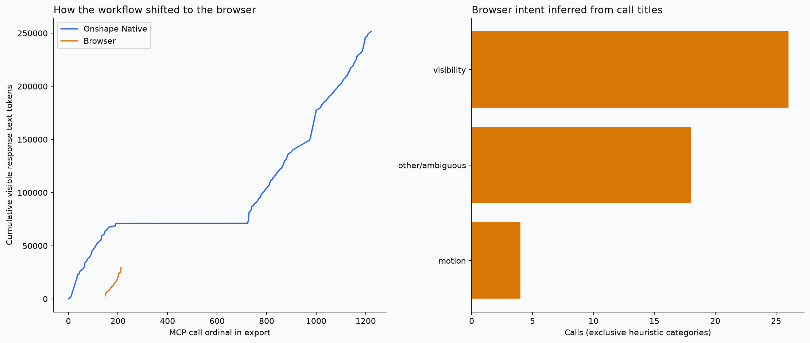
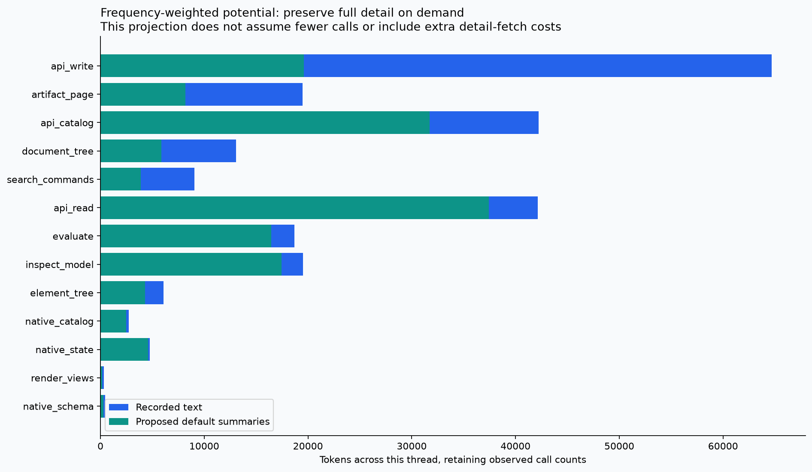

# Frequency-weighted Onshape Native audit

This extends the [size audit](../README.md) with **observed command frequency** from 2 supplied threads. Counted **665 Onshape Native calls, 508 official-API calls and 48 browser calls**, including failures and repeated requests. Official API (`onshape_cad`) usage is **not merged into Native frequencies**. All 35 current Native tools appear in the inventory, including zero-observation entries.

Thread 1 is the design/connector workflow. Thread 2 is the camera-placement workflow, which also includes substantial official-API work. The combined count is call-weighted; the longer second thread has more influence. Compare normalized per-thread frequencies before treating these as general agent behavior.

| Thread | Native calls | Native response tokens | Official API calls | Browser calls |
|---|---:|---:|---:|---:|
| thread-1 | 166 | 70,925 | 0 | 43 |
| thread-2 | 499 | 180,693 | 508 | 5 |



## What the numbers change

The top three tools by recorded response cost—**api_write, api_catalog, api_read** in this two-thread study—account for **59.3%** of the measured Native output. Optimize those first, rather than ranking only by the size of one reply. The size-only 48-call scenario in the previous audit is illustrative; this report uses the attached threads' actual counts and returned text.

Concrete priorities from the observed operations:

- **Compact successful feature-write acknowledgements.** `addFeature` and `updateFeature` produced **44,996 response tokens** across 31 calls, mostly echoing full feature definitions. Keep feature IDs, status, revision/skew and an exact full-definition pointer immediately available; return full parameters only on demand. Preserve rich failure responses.
- **Assembly summaries/projections instead of unusable default pages.** `getAssemblyDefinition` was called **77 times**; **76 returned narrower-pointer hints**. Many of these reads can still be necessary freshness checks. Change their return format to a useful summary plus valid pointers or requested instance/mate fields, not a cache that silently skips verification.
- **Concise schemas with optional explanation.** There are 91 schema calls and **32 repeats after the first within a thread**. Key reusable schema handles by schema/build version. Keep required fields, defaults, enums, units and constraint explanations; make long background prose/examples an explicit detail fetch. The numeric projection strips prose as a sizing experiment, so a production outline must selectively restore descriptions that encode otherwise implicit constraints.
- **Requested mass fields.** `getPartStudioMassProperties` accounts for **13,656 tokens in 18 calls**. Weight-only requests should not automatically include every inertia tensor, but simulation tasks must retain one-step access to mass, centroid, axes and inertia.
- **Keep custom evaluation discoverable.** **28 of 42 evaluation calls used custom FeatureScript**. It is not a rare escape hatch in these tasks. Keep compact measurement/select presets nearby, with custom script support available explicitly.

There were **251,618 visible Native response tokens** and **101,723 compact argument tokens**, plus **29,253 visible browser response tokens**. These are text-tokenizer measurements, not billed totals. Images, unseen tool metadata and missing/truncated exported content are not recoverable as token counts. Missing responses: Native 0, browser 3. Explicit Native errors: 25; narrower-pointer replies: 139.





| Tool | Calls | Mean response tokens | Total response tokens | Errors / pointer fallback |
|---|---:|---:|---:|---:|
| `api_write` | 120 | 539.2 | 64,700 | 3 / 9 |
| `api_catalog` | 112 | 377.2 | 42,245 | 0 / 0 |
| `api_read` | 171 | 246.5 | 42,157 | 6 / 92 |
| `inspect_model` | 42 | 464.5 | 19,509 | 8 / 0 |
| `artifact_page` | 41 | 474.9 | 19,472 | 2 / 4 |
| `evaluate` | 42 | 445.0 | 18,692 | 2 / 5 |
| `document_tree` | 23 | 568.6 | 13,078 | 0 / 7 |
| `search_commands` | 13 | 696.8 | 9,059 | 0 / 0 |
| `element_tree` | 26 | 234.2 | 6,090 | 1 / 0 |
| `native_state` | 13 | 367 | 4,771 | 0 / 10 |
| `resolve_target` | 18 | 202.7 | 3,649 | 0 / 0 |
| `native_catalog` | 4 | 679.5 | 2,718 | 0 / 0 |
| `feature_template` | 14 | 133.1 | 1,864 | 2 / 12 |
| `feature` | 12 | 129.3 | 1,552 | 0 / 0 |
| `bridge_status` | 2 | 276.5 | 553 | 0 / 0 |
| `native_schema` | 2 | 216 | 432 | 0 / 0 |
| `open_document` | 4 | 88.8 | 355 | 0 / 0 |
| `render_views` | 4 | 80 | 320 | 1 / 0 |
| `sidebar_edit` | 1 | 239 | 239 | 0 / 0 |
| `document_edit` | 1 | 163 | 163 | 0 / 0 |
| `api_request` | 0 | — | 0 | 0 / 0 |
| `api_upload` | 0 | — | 0 | 0 / 0 |
| `browse_commands` | 0 | — | 0 | 0 / 0 |
| `capture_viewport` | 0 | — | 0 | 0 / 0 |
| `display_state` | 0 | — | 0 | 0 / 0 |
| `document_history` | 0 | — | 0 | 0 / 0 |
| `mate_animation` | 0 | — | 0 | 0 / 0 |
| `native_read` | 0 | — | 0 | 0 / 0 |
| `native_write` | 0 | — | 0 | 0 / 0 |
| `set_visibility` | 0 | — | 0 | 0 / 0 |
| `sidebar_prepare` | 0 | — | 0 | 0 / 0 |
| `sidebar_verify` | 0 | — | 0 | 0 / 0 |
| `ui_action` | 0 | — | 0 | 0 / 0 |
| `ui_inspect` | 0 | — | 0 | 0 / 0 |
| `view_control` | 0 | — | 0 | 0 / 0 |

## How the tools were used

The opening document navigation consumed **30 document-tree/artifact-page calls and 17,438 response tokens** before the first Part Studio inspection. The agent reduced page sizes after failures, attempted an incorrect `/elements` pointer, discovered `/rows`, then walked small pages to find a target. These calls are real usage, but not all represent desired functionality: a precise element lookup could replace much of the discovery detour without removing browsing.

Schema discovery included **91 schema requests covering 48 distinct schema names**. Repeated exact requests are reported separately in `repeated-requests.csv`; repetition alone does not prove waste, since refreshes and error recovery may be necessary. The full operation breakdown below distinguishes generic tool wrappers from actual actions. FeatureScript custom evaluation, feature edits, assembly operations and topology inspection remain available even when their full schemas are not part of the default response.

| Tool | Requested operation / variant | Calls | Response tokens |
|---|---|---:|---:|
| `api_write` | `addFeature` | 24 | 32,538 |
| `artifact_page` | `pointer:/rows` | 24 | 16,741 |
| `api_read` | `getPartStudioMassProperties` | 18 | 13,656 |
| `evaluate` | `custom` | 28 | 13,484 |
| `api_write` | `updateFeature` | 7 | 12,458 |
| `api_read` | `getAssemblyDefinition` | 77 | 11,760 |
| `document_tree` | `cached-page` | 8 | 10,512 |
| `inspect_model` | `full` | 32 | 9,782 |
| `inspect_model` | `previous-snapshot` | 10 | 9,727 |
| `search_commands` | `default` | 13 | 9,059 |
| `api_write` | `updateWVEPMetadata` | 28 | 5,972 |
| `element_tree` | `fresh` | 24 | 5,295 |
| `native_state` | `default` | 13 | 4,771 |
| `api_read` | `getPartsWMV` | 7 | 4,616 |
| `api_catalog` | `schema:getPartStudioMassProperties` | 5 | 4,105 |
| `api_write` | `addPartStudioFeature` | 10 | 3,780 |
| `resolve_target` | `default` | 18 | 3,649 |
| `evaluate` | `topology` | 5 | 3,622 |
| `api_read` | `getAssemblyMassProperties` | 10 | 3,242 |
| `api_catalog` | `search` | 21 | 3,214 |



## Cache evidence and counting rules

- Found **907 JSON artifacts** in `onshape-native/.runtime/artifacts`; **451 of 810 distinct artifact handles** referenced in the export exist there. They support provenance and the previous response-size study.
- The legacy `.onshape-cache` contains **0 files**. Pytest caches contain test state, not agent command usage. Runtime research/validation JSON is not a chronological call ledger.
- No persistent invocation log was found in the project. The bridge disables HTTP access logging. Artifact files are content-addressed: repeated calls can yield one file, and one call can yield several files. **Do not add artifact counts to transcript frequencies.**
- The export also has **727 shell-code lines referencing the artifact cache**. Shell helpers read/filter geometry locally, so Native call counts alone do not describe all agent work. These are not falsely counted as MCP calls; shell outputs are not comprehensively available in the export.
- The parser counts explicit `MCP tool call` records outside fenced examples, preserves retries and excludes prose mentions. It records source line numbers for traceability, but publishes no raw arguments, model IDs, document names, URLs, response bodies or credentials. Source SHA-256 is in `metrics.json`.
- These are **2 selected threads**, with older skill references (0.2.1). Their frequencies are neither fleet-wide demand nor a reason to remove an unobserved tool. Cache data and transcripts are kept separate to prevent double counting. Cross-export exact call-payload overlap: threads 1/2: 14 shared fingerprints, longest contiguous match 1 call(s). Isolated matches are consistent with repeated standalone reads/schema discovery; they cannot prove event identity without call IDs. Duplicate whole exports are rejected. No events were dropped merely because their arguments/results matched.

## Browser work reveals demand missing from the Native counts



The browser phase inspected inherited connectors, changed marker visibility, exposed revolute controls and previewed lidar motion. Title-based categories are proxies and leave ambiguous calls separate; one browser call is not necessarily one future Native call. Camera framing and screenshots can occur inside multi-action browser calls even when the title emphasizes visibility.

`display_state`, `set_visibility`, `mate_animation`, `view_control` and `capture_viewport` therefore deserve a **task-triggered display/motion group**, despite zero direct calls in this older trace. Do not bury them merely because they were unavailable when this workflow ran.

## Preserve capability through progressive disclosure

1. **Default: compact browse and verify.** Keep target resolution, hierarchy lookup, inspection, bounded measurement results, exact IDs, revision/completeness/error state, and continuation handles immediately available. Add lookup by element ID/name/type and row projection so locating one tab does not require walking an entire document. Retain full traversal as an explicit option.
2. **On demand: full schemas and geometry detail.** A concise operation outline should carry method/path, required fields, constraints and references. Put long descriptions/examples, full optional parameter trees, transforms, normals, topology arrays and camera matrices behind `detail="full"`, `fields=[...]`, or a stable `details_ref`. Do not delete parameters or truncate data; full artifacts remain addressable. Small queries should expose available detail routes so the agent does not guess pointers.
3. **Mutation: compact verification, rich failure detail.** Return changed IDs, new revision/snapshot, verification and partial-completion status by default. Keep per-item full checks and raw native replies in artifacts. Failure diagnostics remain visible; “OK” alone is insufficient.
4. **Task-triggered tools: modeling, assembly, display/motion, advanced REST/native/UI.** Frequency can inform descriptions and suggested routes, but all tool families remain discoverable through search and exhaustive browsing. Native payload schemas, custom FeatureScript, uploads, exports and UI fallback should require one explicit detail step, not disappear. Client-side lazy schema loading is a separate optimization that needs Codex/Claude compatibility tests.
5. **Cache stable discovery, not mutable state.** Reuse operation schemas by schema/build version and feature templates by library/configuration key. Preserve explicit refresh. Snapshot paging may be local; fresh geometry/revision checks must still reach Onshape when needed.

The implementation order should be **feature-write acknowledgements → useful assembly projections → concise/versioned schema discovery → precise hierarchy lookup and compact rows → inspection/mass field selection**. Keep custom evaluation discoverable. The first thread alone made navigation look dominant; the second exposes repetitive assembly modeling. Use per-task routing rather than demoting an entire tool family from one aggregate ranking. The earlier camera-summary optimization remains valuable when display workflows trigger it.

## Frequency-weighted counterfactual




Applying the previous task-specific summaries to the **actual recorded replies**, plus sparse hierarchy artifact rows, schema outlines and compact successful feature acknowledgements, changes the visible Native text subtotal from **251,618 to 160,822 tokens** (90,796 fewer). Call counts are held constant. No unobserved return is assigned a size. No reduction in navigation calls, browser calls or schema fetches is assumed.

This is a sizing experiment, **not an implemented behavior change or guaranteed saving**. Schema outlines move prose/examples out of default responses while retaining machine-readable fields and constraints. Some tasks will fetch full detail and recover that cost; validate whole-task totals and success rates. The implementation must retain every capability through an explicit, documented detail route. Request-token and image costs are not reduced by these projections.

## Reproduce and extend

```sh
uv run --project . --with-requirements scripts/audit-requirements.txt \
  python scripts/frequency_audit.py --thread /path/to/design.md --thread /path/to/camera.md
```

Repeated `--thread` arguments retain per-thread counts and check exact payload-sequence overlap. Do not knowingly combine overlapping exports without call IDs or a documented deduplication rule. For future reliable profiling, collect per-call tool/action, counts, latency, outcome and stable trace/call IDs; keep raw CAD data out of telemetry. A cache file is never a substitute for an invocation event.

Downloads: `tools.csv` (frequency × mean × total), `calls.csv` (sanitized ordered measurements), `variants.csv`, `thread-tools.csv`, `thread-summary.csv`, `official-api-tools.csv`, `argument-fields.csv`, `transitions.csv`, `repeated-requests.csv`, `metrics.json`, and six PNG/SVG charts. The previous size audit remains intact.
